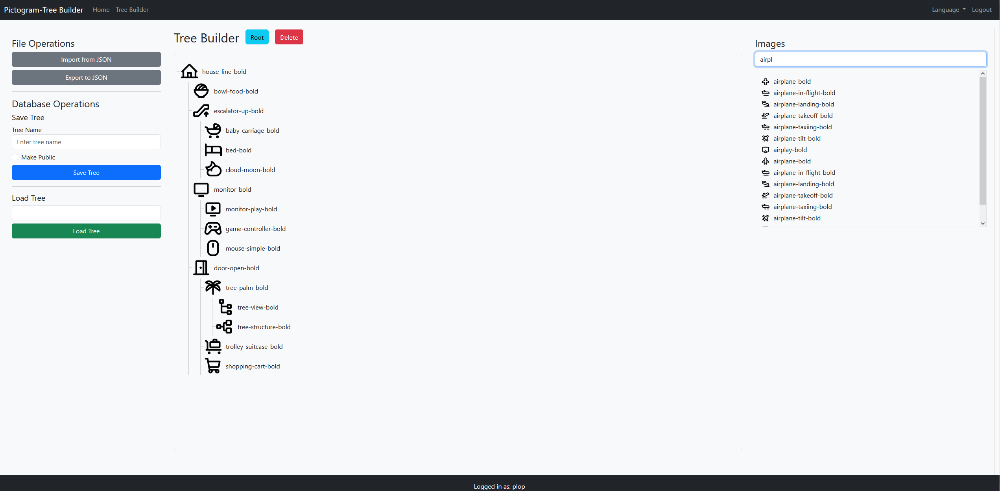

# Pictogram-Tree Builder

## Projet Pictogram-Tree Builder
Ce projet est un site web permettant de créer des arbres composites de pictogrammes. Il est conçu pour être simple d'utilisation, notamment pour des publics spécifiques comme les personnes avec TSA. L'application est développée et maintenue principalement par des agents IA.

## Description

L'application permet aux utilisateurs de s'inscrire, de se connecter et de construire des arborescences visuelles où chaque nœud est une image. Ces arbres peuvent être sauvegardés, partagés publiquement, ou exportés au format JSON.


## Pile Technologique

*   **Backend:** Python 3.10+ avec [Flask](https://flask.palletsprojects.com/)
*   **Base de Données:** SQLite gérée via [Flask-SQLAlchemy](https://flask-sqlalchemy.palletsprojects.com/)
*   **Frontend:** HTML5, CSS3, et JavaScript (ES6 Modules)
*   **Tests:** [Pytest](https://docs.pytest.org/)
*   **Dépendances Python:** Voir `requirements.txt`

## Initialisation et Lancement

1.  **Cloner le dépôt :**
    ```bash
    git clone <URL_DU_DEPOT>
    cd <NOM_DU_DEPOT>
    ```

2.  **Créer un environnement virtuel et l'activer :**
    ```bash
    python -m venv venv
    source venv/bin/activate  # Sur Windows: venv\Scripts\activate
    ```

3.  **Installer les dépendances :**
    ```bash
    pip install -r requirements.txt
    ```

    **Note sur `python-magic` :**
    La bibliothèque `python-magic` est utilisée pour la validation des types de fichiers. Son installation peut varier en fonction de votre système d'exploitation.

    - **Sur Windows :**
      Le paquet `python-magic-bin` dans `requirements.txt` inclut les binaires nécessaires. Aucune étape supplémentaire n'est requise.

    - **Sur macOS (via Homebrew) :**
      ```bash
      brew install libmagic
      ```

    - **Sur les systèmes basés sur Debian/Ubuntu :**
      ```bash
      sudo apt-get update
      sudo apt-get install -y libmagic1
      ```

    - **Sur les systèmes basés sur Red Hat/CentOS :**
      ```bash
      sudo yum install -y file-devel
      ```

4.  **Configurer l'application Flask :**
    - Sur Windows (cmd) :
      ```
      set FLASK_APP=pictogram.py
      ```
    - Sur Windows (PowerShell) :
      ```
      $env:FLASK_APP="pictogram.py"
      ```
    - Sur macOS/Linux :
      ```
      export FLASK_APP=pictogram.py
      ```

5.  **Initialiser la base de données :**
    *Note : La commande `flask db init` ne doit être exécutée qu'une seule fois pour le projet.*
    ```bash
    flask db init
    flask db migrate -m "Initial migration."
    flask db upgrade
    ```

6.  **Lancer l'application :**
    ```bash
    flask run
    ```
L'application sera accessible à l'adresse `http://127.0.0.1:5000`.

## Ajout des pictogrammes à la base de données

Pour scanner le dossier `app/static/images/pictograms` et ajouter toutes les images trouvées à la base de données, exécutez la commande suivante à la racine du projet :

```bash
python add_test_images.py
```

## Contribution via Agents IA

Ce projet est piloté par des agents. Veuillez vous référer aux fichiers `AGENTS.md` et `GEMINI.md` pour les instructions et le workflow de développement.